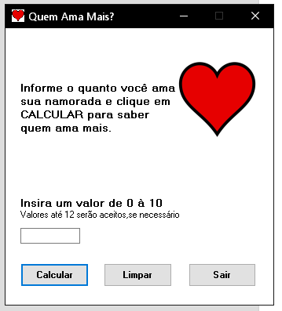
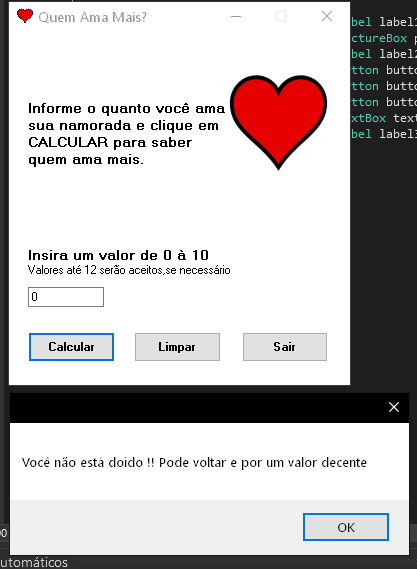

# Aplicação de Cálculo do Amor

Bem-vindo à aplicação de Cálculo do Amor! Este é um programa Windows Forms que permite calcular o nível de amor do(a) namorado(a) de uma pessoa. Siga as instruções abaixo para utilizar a aplicação corretamente.

## Requisitos do Sistema

- Computador com sistema operacional Windows.
- Ambiente de desenvolvimento compatível com Windows Forms (por exemplo, Visual Studio).
- Conhecimentos básicos em programação com C#.

- ## 💻 Apresentação:

<p align="center">
<a href="https://github.com/pblda13/Projeto-Loteria">



</p>

## Como Usar

1. Abra o ambiente de desenvolvimento e crie um novo projeto Windows Forms.

2. Na janela de design do formulário principal, adicione os seguintes componentes:
   - Um rótulo para exibir as instruções.
   - Uma caixa de texto para o usuário inserir o valor de amor (de 0 a 12).
   - Um botão de cálculo.
   - Um rótulo para exibir a mensagem de resultado.

3. No evento de clique do botão de cálculo, adicione a lógica para calcular o nível de amor com base no valor digitado pelo usuário.

4. Utilize uma estrutura condicional (if/else, switch/case) para exibir a mensagem correspondente ao valor inserido. Por exemplo:

   ```
   public void Calcular()
        {
            if (n1 <= 0) {

                MessageBox.Show("Você não está doido !! Pode voltar e por um valor decente ");
            }
            else if (n1 > 0 && n1 <= 5)
            {
                MessageBox.Show("Ainda está muito pouco !! Pode fazer de novo !");
            }
            else if (n1 > 5 && n1 <= 10)
            {
                MessageBox.Show("Eu te amo mais !!");
            }

            else if (n1 > 10 && n1 <=100)
            {
                MessageBox.Show("Seu amor pode até ser grande ,mas eu ainda te amo mais !!");
            }

            else if (n1 > 100 )
            {
                MessageBox.Show("Boa tentativa ,mas sua namorada ainda te amo muito mais !!");
            }
   ```

5. Execute a aplicação e teste digitando diferentes valores de amor e pressionando o botão de cálculo.


## Contribuição

Este projeto foi desenvolvido pela Pâmela Borges Se você identificar algum problema ou desejar contribuir para o projeto, fique à vontade para abrir uma issue ou enviar um pull request no repositório do GitHub.

## Suporte


Esperamos que a aplicação de Cálculo do Amor seja divertida para você e seu(a) namorado(a)! Aproveite!


